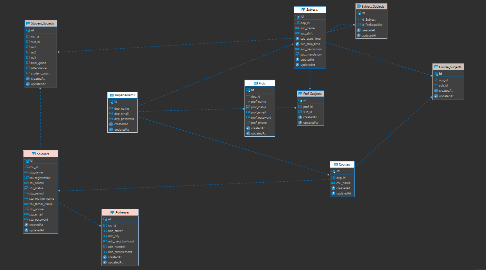

# adm_college

<div align = "center">
  
</div>

### Sobre

<p align="center"> O sistema tem o intuito de ser um controle centralizado para faculdade. Todo o sistema foi desenvolvido e pensado, a partir do modelo de negócio de uma faculdade. Onde foi feito uma lista com todos os requisitos específicos de uma faculdade, como: ter o controle dos alunos, professores, cursos, matérias, histórico escolar e departamento de controle geral</p>


<hr>
<h4 align = "center">
 👷‍♂️Projeto 🚧 adm_college em contrução 🚧 .
</h4>
<hr>

### Desafios

<div>
 Informações gerais: 
  - O sistema possui uma estrutura MONOREPO
  - Possui a imagem geral da aplicação para fazer deploy

</div>

<br>

<hr>
  <p align="center">
    <a href ="#sobre">Sobre</a> -
    <a href ="#desafios">Desafios</a> -
    <a href ="#features">Features</a> -
    <a href ="#ilustração">Ilustração</a> - 
    <a href ="#pré-requisitos">Pré-requisitos</a> -
    <a href ="#database">Database</a> -
    <a href ="#tecnologias_framework">Tecnologias/framework</a> -
    <a href ="#autor">Autor</a>
  </p>
<hr>

<br>


### Features 
* Autenticação:
  - [x] Login Padrão: Departamento, Professor, Aluno
  - [] Sistema de recuperação de conta
  - [] Login externo

* Features Departamento
  - [x] Registra Departamento (apenas 1)
  - [x] Deletar Departamento (apaga todo o sistema)
  - [x] Editar Departamento
  - [x] Registra Professor 
  - [] Editar Professor
  - [] Deletar Professor
  - [] Registar curso
  - [] Editar curso
  - [] Deletar curso
  - [x] Associar máteria a um curso
  - [x] Registra Aluno
  - [] Editar Aluno
  - [] Deletar Aluno
  - [x] Registra máteria
  - [] Editar máteria
  - [] Deletar máteria 
  - [x] Associar máteria a um professor
  - []

* Features Professor:
  - [] Registar nota e frequencia do aluno
  - [] Editar nota e frequencia do aluno
  - []
  - []

* Features Aluno
  - [x] Login do Aluno
  - [] Registrar Endereço do aluno
  - []


### Ilustração

<div align= "center">
   
  
</div> 


### Pré-requisitos

Antes de começar, você vai precisar ter instalado em sua máquina as seguintes ferramentas:
[Git](https://git-scm.com), [Node.js](https://nodejs.org/en/), [Docker](https://learn.microsoft.com/en-us/windows/wsl/setup/environment). Para receber as mensagem de teste para recuperação da conta, sera usado [Mailtrap](https://mailtrap.io/). Além disto é bom ter um editor para trabalhar com o código como [VScode](https://code.visualstudio.com/)


### ⚙️ Rodando o sistema

```bash
#Clone este repositório
$ git clone <https://github.com/fabioamorim25/adm_college.git>

#Instalar dependencias --------------------
#Acesse a pasta do projeto no terminal/cmd
$ cd adm_college
# Instale as deprendências
$ yarn install

#Configurar o batabase -----------------------------------
# ver as tabelas e os dados do batabase
$ yarn prisma studio

# Execute a aplicação server e web ----------------------------------------

# A web iniciará na porta:3000 - acesse <http://localhost:3000>
# O server iniciará na porta:5000 - acesse origem <http://localhost:5000>
  
# Execute web e server
$ yarn start
# Execute apenas o server
$ yarn server
# Execute apenas a web
$ yarn web

```

### Database

#### - Modelo Conceitual
<div align= "center">
   
</div>

#### - Modelo Logico (Aplicando a 1°,2° e 3° forma normal)
<div align= "center">
   
</div>

#### - Modelo Logico no Prisma
<div align= "center">
   
</div>
<br>

### 🛠️Tecnologias_framework

As seguintes ferramentas foram usadas na construção do projeto:

#### Front end
- [Next.js](https://nextjs.org/)
- [Next Auth](https://next-auth.js.org/)
- [Tailwindcss](https://tailwindcss.com/)
- [Typescript](https://www.typescriptlang.org/)


#### Back end
- [Node.js](https://nodejs.org/en/)
- [Express js](https://expressjs.com/pt-br/)
- [Prisma](https://https://www.prisma.io/)
- [Nodemailer](https://nodemailer.com/about/)


### Autor

[Fábio Amorim](https://linkedin.com/in/fabio-amorim-4545011a1) 😊
